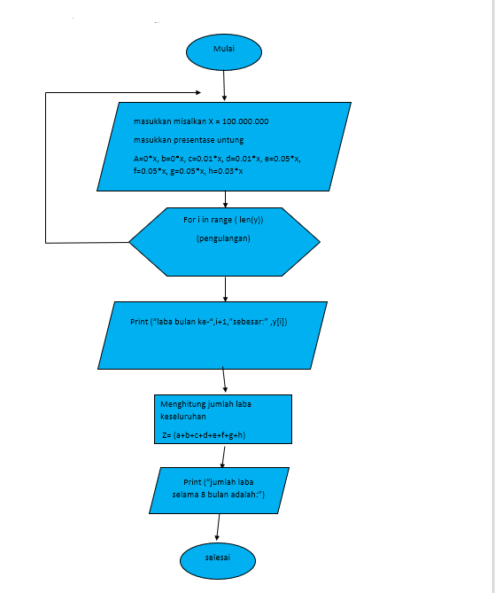

# Labpy03

# LATIHAN MENAMPILKAN BILANGAN ACAK YANG LEBIH KECIL DARI 0,5
- Buat kodingan seperti pada gambar dibawah ini
- menggunakan fungsi random() untuk membangkitkan nilai random
.py.png)
# Penjelasan
- Berikut penjelasan Latihan1.py
"print"  : berfungsi untuk mencetak atau menampilkan objek ke perangkat keluaran (layar) atau ke file teks.
"import" : fungsi lanjut yang dipanggil oleh statement import.
"random" : untuk menentukan suatu pilihan. 
"range"  : merupakan fungsi yang menghasilkan list. Fungsi ini akan menciptakan sebuah list baru dengan rentang nilai tertentu. 
"uniform": digunakan untuk menampilkan bilangan float random dengan batas awal bilangan x, dan batas akhir bilangan y.
- Maka Hasilnya seperti dibawah ini

**FLOWCHART DARI PROGRAM DIATAS**

# LATIHAN MENAMPILKAN BILANGAN TERBESAR DARI BUAH DATA YANG DIINPUTKAN LALU ANGKA 0 UNTUK BERHENTI
- Buat kodingan seperti pada gambar dibawah ini
- Menggunakan angka nol untuk berhenti yaitu menggunakan fungsi break
.png)
# Penjelasan
- Berikut penjelasan Latihan2.py
"max" : fungsi bulid-in untuk mencari nilai tertinggi. Fungsi ini dapat diberikan sebuah parameter berupa angka.
"while" : disebut uncounted loop (perulangan yang tak terhitung), untuk perulangan yang memiliki syarat dan tidak tentu berapa banyak perulangannya.
"int" : berfungsi mengkonversi bilangan maupun string angka menjadi bilangan bulat (integer).
"if" = Bila suatu kondisi tertentu tercapai maka apa yang harus dilakukan. Dengan fungsi ini kita bisa menjalankan suatu perintah dalam kondisi tertentu.
"input" : masukan yang kita berikan ke program.
"break" : fungsi yang menghentikan operasi dibawahnya jika suatu kondisi yang ditentukan telah tercapai.
"print" : berfungsi untuk mencetak atau menampilkan objek ke perangkat keluaran (layar) atau ke file teks.
- Maka hasilnya seperti dibawah ini

**FLOWCHART DARI PROGRAM DIATAS**

## Alur Algoritma program1.py

- Buat program sederhana dengan perulangan,
- Seorang pengusaha menginvestasikan uangnya untuk memulai usahanya
- Dengan modal awal 100 juta
- Pada bulan pertama dan kedua belum mendapatkan laba
- Pada bulan ketiga baru mulai mendapatkan laba sebesar 1%
- Pada bulan kelima pendapatan meningkat 5%
- Selanjutnya pada bulan ke-8 mengalami penurunan keuntungan sebesar 2%
- Sehingga laba menjadi 3%
- Hitung total keuntungan selama 8 bulan berjalan usahanya

- Kita mulai cara membuat program diatas 👆

**FLOWCHART**

- Lakukan kodingan seperti dibawah ini
.png)
- Jika sudah kalian bisa save program kalian dengan tekan **CTRL+S** atau mengklik menu file - save as dan beri nama pada program kalian
- lalu menjalankan program kalian dengan menekan **f5** atau mengklik menu **RUN**
- Hasilnya akan seperti gambar dibawah ini
.png)
# Penjelasan
- Berikut Penjelasan Program1.py
- masukkan nilai a
- gunakan for untuk perulangan dari 1 sampai 8.Perulangan for disebut counted loop (perulangan yang terhitung)
- lalu gunakan if pertama untuk menentukan laba bulan ke 1 dan ke 2.masukan variabel (b) kalikan nilai (a) dengan data bulan 1 dan 2. cetak (x) dan (b)
- lalu gunakan if kedua untuk menentukan laba bulan ke 3 dan ke 4.masukan variabel (b) kalikan nilai (a) dengan data bulan 3 dan 4. cetak (x) dan (c)
- lalu gunakan if ketiga untuk menentukan laba bulan ke 5 sampai ke 7.masukan variabel (b) kalikan nilai (a) dengan data bulan 5 sampai 7. cetak (x) dan (d)
- lalu gunakan if keempat untuk menentukan laba bulan ke 8.masukan variabel (b) kalikan nilai (a) dengan data bulan 8. cetak (x) dan (e)
- lalu total keseluruhan.
- cetak total
